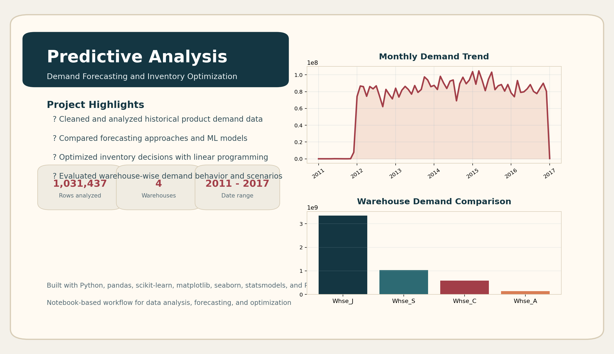

# Predictive Analysis for Demand Forecasting and Inventory Optimization



This project focuses on analyzing historical product demand data, building demand forecasting workflows, and applying inventory optimization techniques to support better supply chain decisions.

The work is presented through Jupyter notebooks and combines data cleaning, exploratory analysis, machine learning, and linear programming based optimization.

## Overview

The main goal of this project is to use historical order demand data to:

- understand demand patterns across products and warehouses
- prepare data for predictive modeling
- compare forecasting approaches
- optimize inventory allocation and replenishment decisions
- evaluate scenario and sensitivity changes in demand

## Key Features

- end-to-end demand data preprocessing
- exploratory data analysis with trend and distribution plots
- feature engineering for predictive modeling
- model comparison using Linear Regression, Decision Tree, and Random Forest
- inventory optimization using PuLP
- sensitivity analysis for changing demand conditions

## Project Files

- `PredictiveAnaOptimized.ipynb`  
  Refined and validated notebook with forecasting and optimization workflow.

- `PredictiveAnalysis.ipynb`  
  Original notebook covering exploratory analysis, model training, and optimization experiments.

- `Historical Product Demand.csv`  
  Raw dataset used for the analysis.

- `data_processed.csv`  
  Processed dataset derived from the source file.

## Tools and Libraries

- Python
- Jupyter Notebook
- pandas
- numpy
- matplotlib
- seaborn
- scikit-learn
- statsmodels
- PuLP

## Setup

Clone the repository and install dependencies:

```bash
pip install -r requirements.txt
```

Launch Jupyter Notebook:

```bash
jupyter notebook
```

Open either notebook from the project folder and run the cells in order.

## Results Summary

This project demonstrates how predictive analytics can be used to connect historical demand patterns with inventory planning decisions. The optimized notebook successfully runs through forecasting, optimization, and comparative evaluation workflows in the validated environment.

## Validation

- `PredictiveAnaOptimized.ipynb` was executed successfully during project verification.
- `PredictiveAnalysis.ipynb` was reviewed and fixed so its workflow completes correctly.

## Future Improvements

- convert notebook logic into modular Python scripts
- add clearer business assumptions for the optimization model
- create a lightweight version without large dataset files
- build a simple dashboard for results visualization

## License

This project is licensed under the MIT License.
